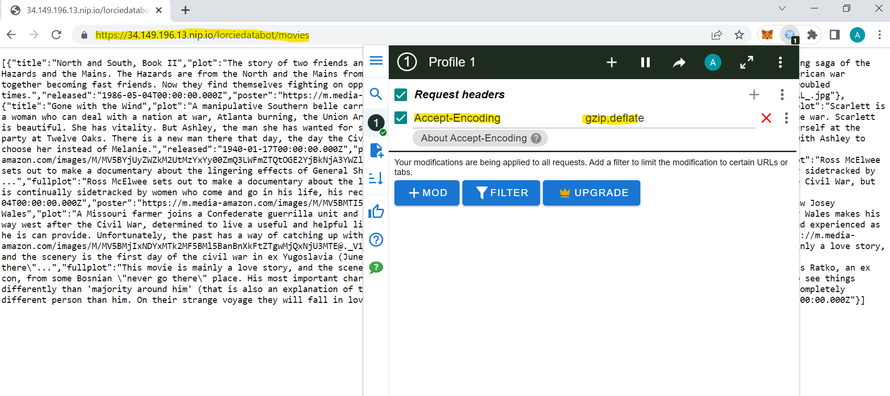

# Databot Application

# Table of contents
1. [Introduction](#introduction)
2. [Architecture](#architecture)
3. [Local Development](#development)
4. [Apigee Configuration](#apigee)
5. [Atlas MongoDb Configuration](#atlas-mongodb)
6. [Screenshots](#screenshots)

## Introduction <a name="introduction"></a>
Databot showcases intelligent search on **MongoDb** Atlas Database thanks to **OpenAI** Embeddings, generated on Database Triggers.
External User Requests come from **ApiGee** Google Cloud and processed with **Node JS** backend module, using these Embeddings.

The application backend Node JS module is hosted on  **Render** and associated to the ApiGee Reverse Proxy

## Architecture <a name="architecture"></a>


## Local Development <a name="development"></a>

1. Only for the first time, Clone the project locally, change into the directory, install the dependencies and init environment variables :

```sh
git clone https://github.com/lorcie/lorciedatabot.git
```

- go inside local backend directory

```
cd lorciedatabot
```

- If needed install node modules / librairies as follows

```
npm install
```

- If needed, to initiliaze environment variables correctly for evaluation purpose, copy .env.eval into .env

windows>
```
copy .env.eval  .env
```

linux>
```
cp .env.eval  .env
```

2. Run local backend application

in the application directory,

- Start the backend application on local environment with following command. It will return local port 8081


```
npm run start
```

- on local browser,

+ Run the backend application locally by browsing at following url :
http://localhost:8081/movies


+ Run following url to search movies about specific thematic such as "hackathon". It will return results about hackers.

http://localhost:8081/movies/hackathon

```
[{"title":"The Girl with the Dragon Tattoo","plot":"A journalist is aided in his search for a woman who has been missing -- or dead -- for forty years by a young female hacker.","fullplot":"Forty years ago, Harriet Vanger disappeared from a family gathering on the island owned and inhabited by the powerful Vanger clan. Her body was never found, yet her uncle suspects murder and that the killer is a member of his own tightly knit but dysfunctional family. He employs disgraced financial journalist Mikael Blomkvist and the tattooed, ruthless computer hacker Lisbeth Salander to investigate. When the pair link Harriet's disappearance to a number of grotesque murders from almost forty years ago, they begin to unravel a dark and appalling family history; but, the Vangers are a secretive clan, and Blomkvist and Salander are about to find out just how far they are prepared to go to protect themselves.","released":"2010-04-30T00:00:00.000Z","poster":"https://m.media-amazon.com/images/M/MV5BMTc2Mjc0MDg3MV5BMl5BanBnXkFtZTcwMjUzMDkxMw@@._V1_SY1000_SX677_AL_.jpg"},{"title":"Sunset Blvd.","plot":"A hack screenwriter writes a screenplay for a former silent-film star who has faded into Hollywood obscurity.","fullplot":"The story, set in '50s Hollywood, focuses on Norma Desmond, a silent-screen goddess whose pathetic belief in her own indestructibility has turned her into a demented recluse. The crumbling Sunset Boulevard mansion where she lives with only her butler, Max who was once her director and husband has become her self-contained world. Norma dreams of a comeback to pictures and she begins a relationship with Joe Gillis, a small-time writer who becomes her lover, that will soon end with murder and total madness.","released":"1950-08-25T00:00:00.000Z","poster":"https://m.media-amazon.com/images/M/MV5BMTU0NTkyNzYwMF5BMl5BanBnXkFtZTgwMDU0NDk5MTI@._V1_SY1000_SX677_AL_.jpg"},{"title":"We Live in Public","plot":"A documentary focusing on the life of dot-com entrepreneur Josh Harris, and his exploits over the last decade.","fullplot":"On the 40th anniversary of the Internet, WE LIVE IN PUBLIC tells the story of the effect the web is having on our society as seen through the eyes of \"the greatest Internet pioneer you've never heard of\", visionary Josh Harris. Award-winning director, Ondi Timoner (\"DIG!\"), documented his tumultuous life for more than a decade, to create a riveting, cautionary tale of what to expect as the virtual world inevitably takes control of our lives. Josh Harris, often called the \"Warhol of the Web\" through the infamous dot.com boom of the 1990's, founded Pseudo.com, the first Internet television network and created his vision of the future, an underground bunker in NYC where 100 people lived together on camera for 30 days over the millennium. He proved how in the not-so-distant future of life online, we will willingly trade our privacy for the connection and recognition we all deeply desire. Through his experiments, including a six-month stint living under 24-hour live surveillance online which led him to mental collapse, he demonstrated the price we will all pay for living in public.","released":"2010-09-03T00:00:00.000Z","poster":"https://m.media-amazon.com/images/M/MV5BMjE4MjE2MzA3MF5BMl5BanBnXkFtZTcwMzY5Nzc3Mg@@._V1_SY1000_SX677_AL_.jpg"},{"title":"Live Free or Die Hard","plot":"John McClane and a young hacker join forces to take down master cyber-terrorist Thomas Gabriel in Washington D.C.","fullplot":"When someone hacks into the computers at the FBI's Cyber Crime Division; the Director decides to round up all the hackers who could have done this. When he's told that because it's the 4th of July most of their agents are not around so they might have trouble getting people to get the hackers. So he instructs them to get local PD'S to take care of it. And one of the cops they ask is John McClane who is tasked with bringing a hacker named Farrell to the FBI. But as soon as he gets there someone starts shooting at them. McClane manages to get them out but they're still being pursued. And it's just when McClane arrives in Washington that the whole system breaks down and chaos ensues.","released":"2007-06-27T00:00:00.000Z","poster":"https://m.media-amazon.com/images/M/MV5BNDQxMDE1OTg4NV5BMl5BanBnXkFtZTcwMTMzOTQzMw@@._V1_SY1000_SX677_AL_.jpg"},{"title":"Indie Game: The Movie","plot":"A documentary that follows the journeys of indie game developers as they create games and release those works, and themselves, to the world.","fullplot":"A documentary that follows the journeys of indie game developers as they create games and release those works, and themselves, to the world.","released":"2012-09-15T00:00:00.000Z","poster":"https://m.media-amazon.com/images/M/MV5BMjA5NTUzMjQ1MV5BMl5BanBnXkFtZTcwMzc1MzQ4Nw@@._V1_SY1000_SX677_AL_.jpg"}]
```

- on Postman, it is also possible to test with POST method as follows :
  in body tab , select x-www-form-urlencoded and initialize *input* key parameter with query value such as : *find some movies about civil war*

## Apigee Configuration <a name="apigee"></a>

- here are instructions to provision APigee with evaluation organization on your google cloud project (to be created if necessary) : 

https://cloud.google.com/apigee/docs/api-platform/get-started/eval-orgs

I have chosen *default* options, *Automatically allocate IP range* for network, *europe-west1* for region/location (please change according to your preference) and also *external* access routing, *wildcard DNS service* option for domain setting

- here are instructions for creating an API proxy, i have chosen for simple discovery purpose  *Pass through (no authorization)*  policy security option :

https://cloud.google.com/apigee/docs/api-platform/get-started/create-proxy

- you can adapt the target endpoint url wto reach your public backend api.

- you can now deploy the API proxy and test it with curl or browser with appropriate url (see environment group to have the DNS)  :

https://cloud.google.com/apigee/docs/api-platform/get-started/test-proxy

- I had to add some preflow instructions to fix *unsupprted content "br"* issues and create some revision update to deploy

- I have exported my proxy definition from <yourproxy> develop tab (select last revision)

- 


## Atlas MongoDb Configuration <a name="atlas-mongodb"></a>

- If needed, create a MongoDB Atlas account, Cluster, Database, Collection
I have used sample_mflix database, included in sample database

- define secret and values containing your openAI key

- create a Mongo Atlas Trigger, which refers to your own database, collection, to generate automatically OpenAI embeddings. Set operation type options (*insert*, *update*, *replace*) and use following Triiger function definition

```
exports = async function(changeEvent) {
    // Get the full document from the change event.
    const doc = changeEvent.fullDocument;

    // Define the OpenAI API url and key.
    const url = 'https://api.openai.com/v1/embeddings';
    // Use the name you gave the value of your API key in the “Values” utility inside of App Services
    const openai_key = context.values.get("openAI_value");

    try {
        console.log(`Processing document with id: ${doc._id}`);

        // Call OpenAI API to get the embeddings.
        let response = await context.http.post({
            url: url,
             headers: {
                'Authorization': [`Bearer ${openai_key}`],
                'Content-Type': ['application/json']
            },
            body: JSON.stringify({
                // The field inside your document that contains the data to embed, here it is the “plot” field from the sample movie data.
                input: doc.plot,
                model: "text-embedding-ada-002"
            })
        });

        // Parse the JSON response
        let responseData = EJSON.parse(response.body.text());

        // Check the response status.
        if(response.statusCode === 200) {
            console.log("Successfully received embedding.");

            const embedding = responseData.data[0].embedding;

            // Get the cluster in MongoDB Atlas.
            const mongodb = context.services.get('lorcieDatabase');
            const db = mongodb.db('sample_mflix'); // Replace with your database name.
            const collection = db.collection('movies'); // Replace with your collection name.

            // Update the document in MongoDB.
            const result = await collection.updateOne(
                { _id: doc._id },
                // The name of the new field you’d like to contain your embeddings.
                { $set: { plot_embedding: embedding }}
            );

            if(result.modifiedCount === 1) {
                console.log("Successfully updated the document.");
            } else {
                console.log("Failed to update the document.");
            }
        } else {
            console.log(`Failed to receive embedding. Status code: ${response.statusCode}`);
        }

    } catch(err) {
        console.error(err);
    }
};
```

- create an atlas search index  using following definition :

```
{
  "mappings": {
    "dynamic": true,
    "fields": {
      "plot_embedding": {
        "dimensions": 1536,
        "similarity": "euclidean",
        "type": "knnVector"
      }
    }
  }
}
```

- ingest data in the database, that will execute automatically triggers on each data row insert


## Screenshots <a name="screenshots"></a>
MongoDB Atlas Database Collection>


MongoDB Atlas Database Trigger>


MongoDB Atlas Database Trigger Function>


MongoDB Atlas Database App Service Values Secret>


ApiGee Google Cloud Setting>


Postman Query Post Test >

- set header *accept-encoding* with value : application/gzip

- set some value for parameter *input*  key : example 'find movies about civil war'

- set postman query method to *post*

- then click on following post query url : https://34.149.196.13.nip.io/lorciedatabot/query


Browser Query Get Test >

- deploy/activate plugin such as *ModHeader* on Chrome Browser

- set Header *Accept-Encoding* with value *grip,deflate*

- then click on following get query url such as : https://34.149.196.13.nip.io/lorciedatabot/movies



