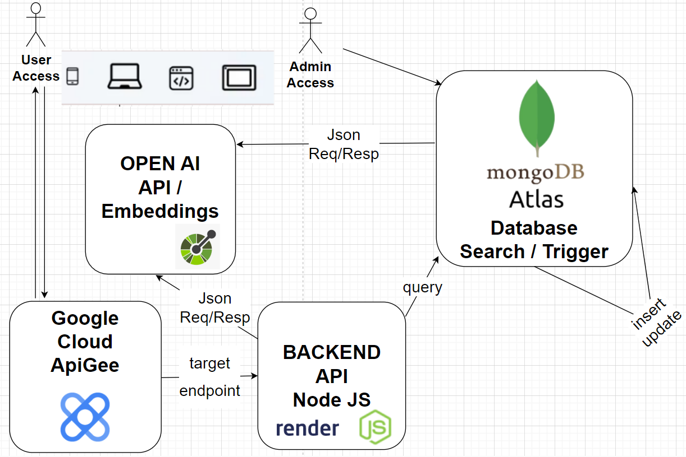
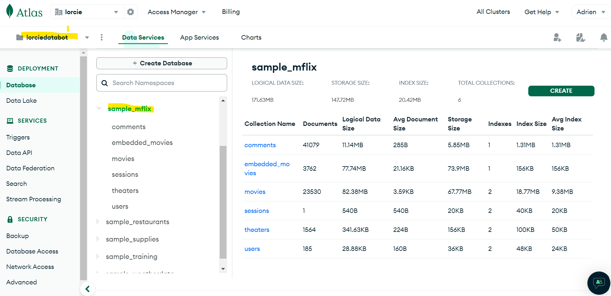
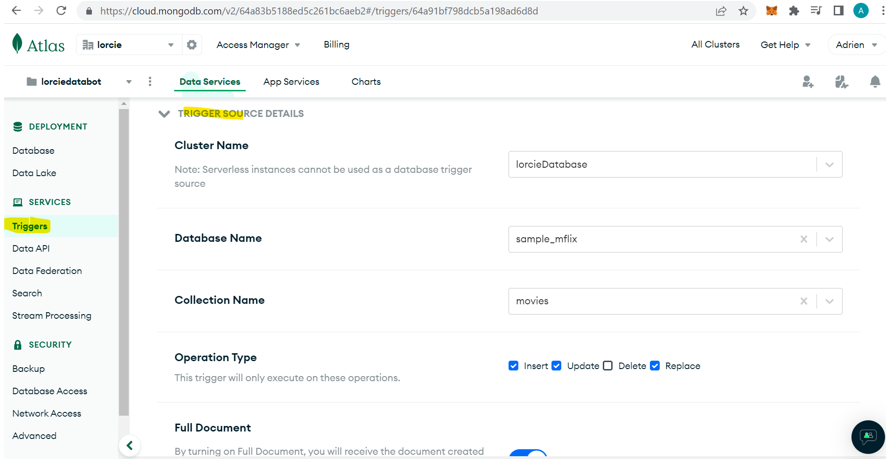
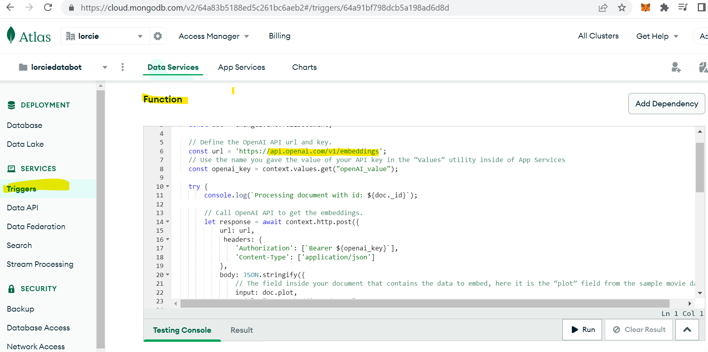
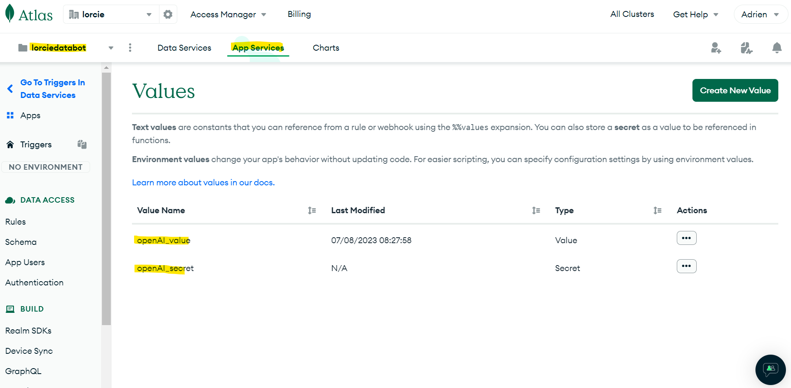
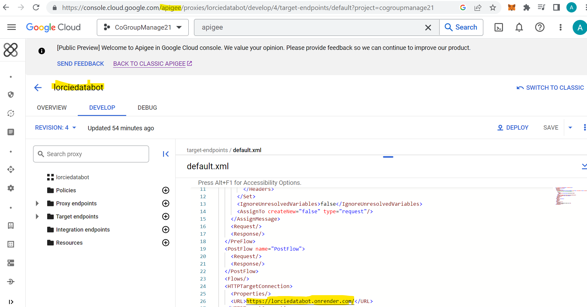
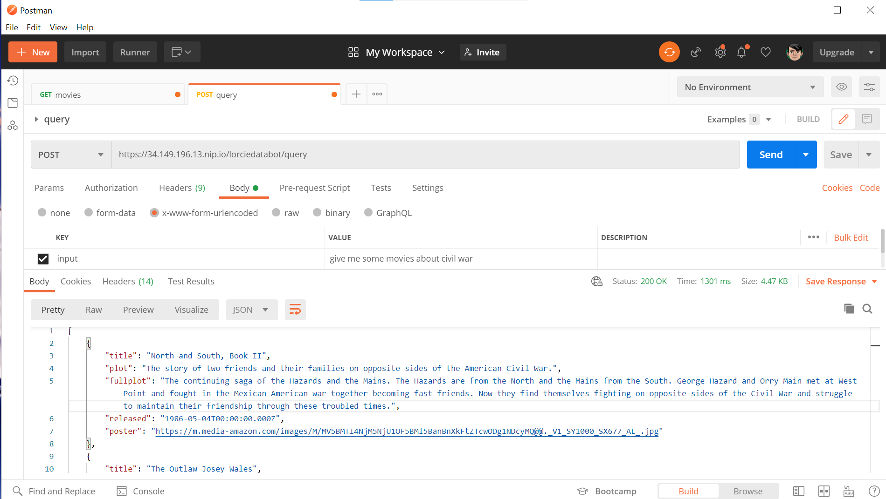

# Databot Application

# Table of contents
1. [Introduction](#introduction)
2. [Architecture](#architecture)
3. [Screenshots](#screenshots)
4. [Resources](#resources)

## Introduction <a name="introduction"></a>
Databot showcases intelligent search on **MongoDb** Atlas Database thanks to **OpenAI** Embeddings, generated on Database Triggers.
External User Requests come from **ApiGee** Google Cloud and processed with **Node JS** backend module, using these Embeddings.

The application backend Node JS module is hosted on  **Render** and associated to the ApiGee Reverse Proxy

## Architecture <a name="architecture"></a>




## Local Development <a name="development"></a>

1. Only for the first time, Clone the project locally, change into the directory, install the dependencies and init environment variables :

```sh
git clone https://github.com/lorcie/lorciedatabot.git
```

- go inside local backend directory

```
cd lorciedatabot
```

- If needed install node modules / librairies as follows

```
npm install
```

- If needed, to initiliaze environment variables correctly for evaluation purpose, copy .env.eval into .env

windows>
```
copy .env.eval  .env
```

linux>
```
cp .env.eval  .env
```

2. Run local backend application

in the application directory,

- Start the backend application on local environment with following command. It will return local port 8081


```
npm run start
```

- on local browser, Run the backend application locally by browsing at following url :
http://localhost:8081/movies

- on Postman, it is also possible to test with POST method as follows :
  in body tab , select x-www-form-urlencoded and initialize *input* key parameter with query value such as : *find some movies about civil war*


## Screenshots <a name="screenshots"></a>
MongoDB Atlas Database Collection>



MongoDB Atlas Database Trigger>



MongoDB Atlas Database Trigger Function>


MongoDB Atlas Database App Service Values Secret>



ApiGee Google Cloud Setting>



Postman Query Post Test >

- set header *accept-encoding* with value : application/gzip

- set some value for parameter *input*  key : example 'find movies about civil war'

- set postman query method to *post*

- then click on following post query url : https://34.149.196.13.nip.io/lorciedatabot/query




